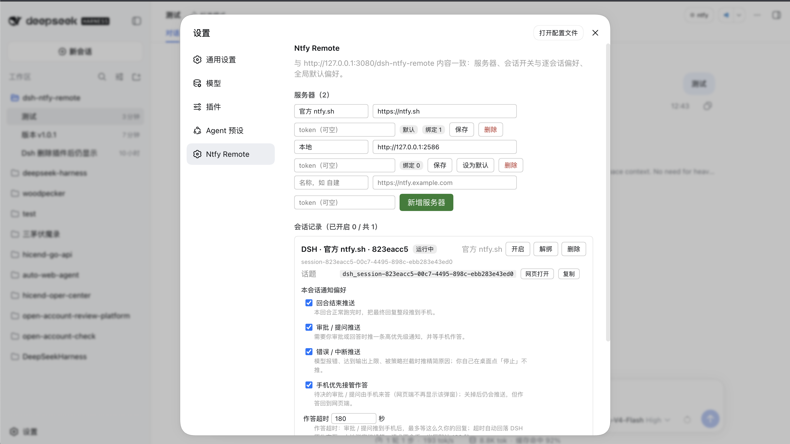
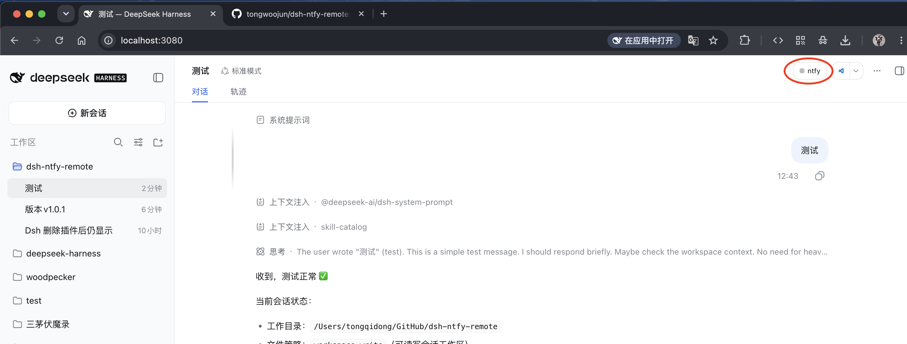
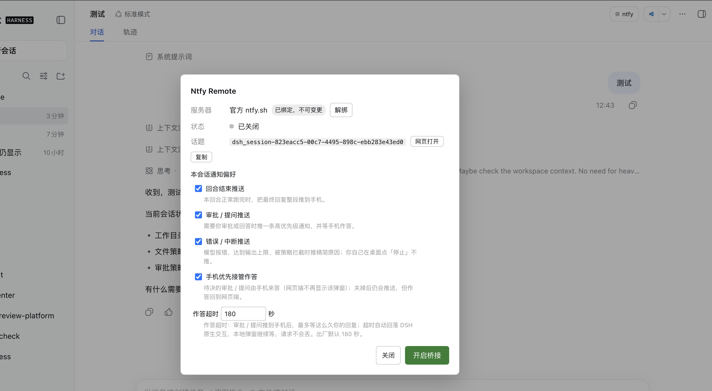
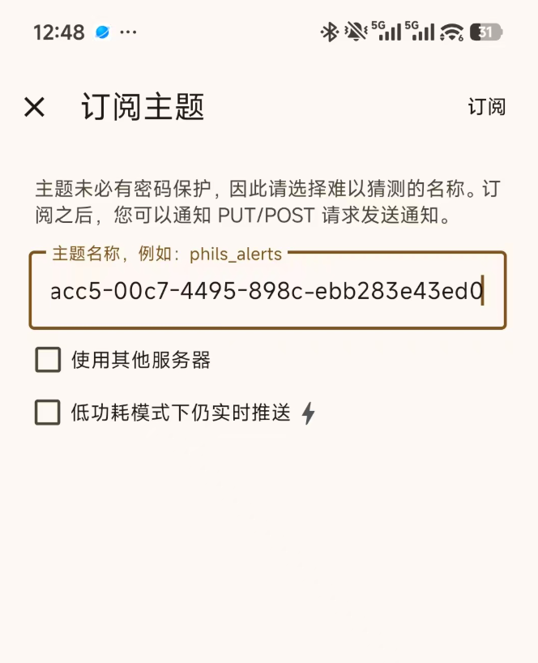
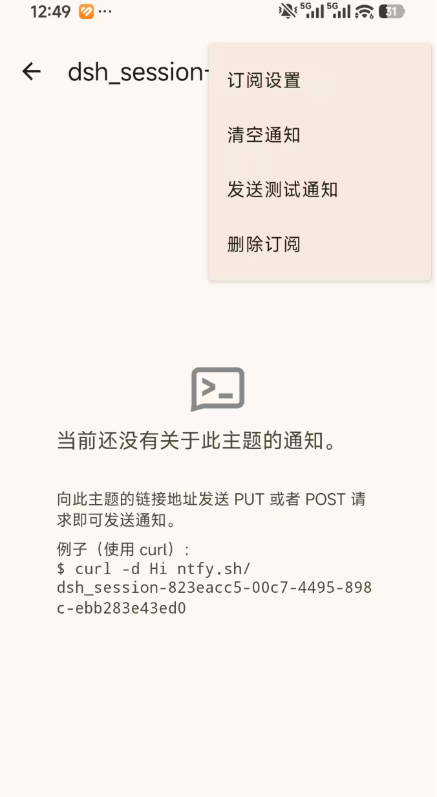
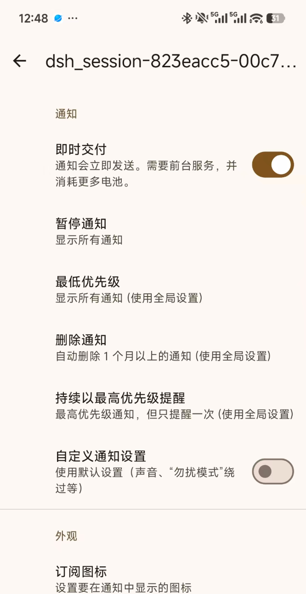

# Ntfy Remote

[](https://www.npmjs.com/package/dsh-ntfy-remote)
[](./LICENSE)
[](package.json)

**让 DSH 干完活叫你一声，也能在手机上直接把活答完。**

DSH 跑长任务时你得守着屏幕才知道结果；模型一旦要审批、要你选方案，任务就卡在那儿等你。
Ntfy Remote 把**每个会话桥接到一个 [ntfy](https://ntfy.sh) 话题**：任务完成、待审批、
待提问都推到手机，你在手机上点一下按钮或打一句话，答案就直接回到正在运行的会话里。

不需要公网 IP、不需要端口映射、不需要自己写机器人 —— 插件主动向 ntfy 服务器建立长连接，
手机端就是一个普通的 ntfy App。

## 为什么用它

| 痛点 | 它怎么解决 |
|---|---|
| 长任务跑完才知道结果 | 回合结束时把最终回复整段推到手机 |
| 模型要审批 / 提问，你不在电脑前，任务干等 | 待决请求推到手机，点按钮或回一句话就作答 |
| 自己接推送要公网入口、端口映射、HTTPS、机器人后端 | 手机端只是 ntfy App，插件主动出站长连接 |
| 不想为通知维护一套服务 | 复用 ntfy 的发布 / 订阅，零后端代码 |
| 一个 Agent 只能绑一个微信 / 飞书，多会话消息全挤在一起 | 每个会话一个话题，哪个 Agent 在找你一眼分清 |
| 通知渠道被单一 IM 绑定，换项目 / 换环境要重新配 | 支持配置多个 ntfy 服务器，按项目、按环境分开推 |

## 和微信 / 飞书通知的区别

微信 / 飞书通知的本质是：**把你的人绑进一个 IM 账号**，再让 Agent 往这个账号里发消息。
这带来两个问题：

- **一个 Agent 只能绑一个账号 / 机器人。** 多开几个会话，消息全进同一个对话框，你分不清是谁在找你。
- **渠道是写死的。** 想按项目分开推、想换一个推送服务，都得重新折腾一遍接入。

Ntfy Remote 换了个思路：**不绑人，绑会话**。

- **每个会话 = 一个独立话题（topic）。** 会话 A 的审批不会混进会话 B 的结果里，手机上按话题就能分辨来源。
- **可以配多个 ntfy 服务器。** 生产环境推一个、实验环境推另一个，或者一台手机收全部、按需订阅。
- **渠道和 Agent 解耦。** 你用的是 ntfy 这个通用发布 / 订阅通道，不是某个 IM 的机器人接口。今天用 ntfy，
  明天想换，Agent 侧不用动。

> 一句话：微信 / 飞书是「一个 Agent 找一个账号」，它是「每个会话有自己的频道」。

## 功能

### 推送到手机

- **回合结束**：把这一轮的最终回复原文推给你（超长会拆成多条继续发，不截断）
- **待审批 / 待提问**：高优先级推送，审批直接带 `Approve` / `Deny` 按钮
- **错误与中断**：模型报错、达到输出上限、被策略拦截时，推一条精简原因
- 你自己在桌面点「停止」、以及子 agent 的回合**不会**打扰你
- 通知就落在会话话题里：手机上点开通知即可直接回复，不依赖 `ntfy://` 深链接，**iOS 也能用**

### 在手机上作答

- **审批**：点 `Approve` / `Deny`
- **提问**：选项 ≤ 3 时是按钮；超过 3 个改成编号列表，回编号即可
- **多选提问**：回 `1,3` 一次选中多个（`,`、`、`、空格都算分隔符）
- **自由文本**：在话题里直接打字，内容会作为你的消息注入正在运行的会话
- **指令**：`/stop` 中止当前回合、`/status` 看状态、`/key` 看话题、`/help`

### 扫码添加到手机话题

会话右上角 `● ntfy` 弹窗里有一张**二维码**：内容就是该会话的 `ntfy://服务器/话题` 深链接，
用手机 ntfy App 扫一下即可订阅这个话题，不必手抄那串 `dsh_<会话 id>`。换会话就换一张码，
扫错不会串到别的话题。

二维码**在宿主侧现算**（`GET /dsh-ntfy-remote/session/qr?sessionId=…` 返回一张自包含的 SVG），
不是把话题名发给第三方在线生成服务——话题名不离开本机，断网也能出图。

### 通知偏好

五项，**全局默认 + 每个会话单独覆盖**（改过的项会高亮，可一键「跟随默认」）：

| 设置 | 作用 | 默认 |
|---|---|---|
| 回合结束推送 | 正常结束时推送最终回复 | 开 |
| 审批 / 提问推送 | 待决时推高优先级通知并接管作答 | 开 |
| 错误 / 中断推送 | 异常结束时推送精简原因 | 开 |
| 手机优先接管作答 | 由手机而不是网页来答审批 / 提问 | 开 |
| 作答超时 | 等手机作答的秒数；超时回落网页端，网页弹窗继续等，请求不会丢 | 180 秒 |

另有一项全局的**单条上限**（默认 4000 **字节**，1 个汉字约 3 字节）。ntfy 对单条
消息的硬上限是 4095 字节，超了会被服务端整条拒收，所以超出部分会**自动拆成多条
继续发**，内容不会丢——只有第一条响铃，后续几条静音并在标题上标 `(2/3)` 这样的序号。
推送正文按 markdown 渲染（标题、列表、代码块、链接都会正常显示）。

会话里的「本会话通知偏好」把上面这张表直接写到了界面上：**每一项控件下面都有一行灰字说明
它做什么**（同时也是悬停提示），不用去翻文档。

### 多服务器

可以配置多个带名称的 ntfy 服务器（官方 ntfy.sh 或自建，支持 access token）。会话
**首次开启**时选定服务器，之后不可变更 —— 避免运行中改地址造成话题漂移。服务器失联或
地址填错时留了**解绑**退路：关闭该会话的桥接后即可解绑并重选。还有会话绑着的服务器
不允许删除，避免那些会话永久失去推送。

### 三处入口

1. **会话右上角 `● ntfy`**：就地开关、查看话题与链接、**扫码把话题加到手机**、调整本会话通知偏好；
   话题名旁边是两个同样式的小按钮——**网页打开**（新标签打开该话题页）和**复制**（复制话题名到剪贴板，
   成功/失败就地回显）
2. **设置 → Ntfy Remote**：服务器增删改、全局默认偏好、所有会话总览
3. **状态页** `http://127.0.0.1:<端口>/dsh-ntfy-remote`：内容与设置页一致，不需要任何前端构建

### 会话归档或删除后自动收起

你在 DSH 里**归档**（= 从侧边栏收起）或**删除**某个会话时，插件会自动断开它的桥接，并把这行
从「设置 → Ntfy Remote」的列表里移除 —— 不会留下一行"运行中"的幽灵记录，也不会继续订阅那个话题。

列表里只列出**开过桥接的会话**（有绑定 / 开关 / 偏好），每行都有一个 **删除** 按钮：只删 Ntfy
Remote 里的绑定 / 开关 / 偏好，**不会删除 DSH 会话**（会话文件和聊天记录都在，想再用就在那个会话里
重新 `/ntfy on`）。与「解绑」不同，它不需要先关闭桥接，随时可用。活着但从没开过桥接的会话不会
列在这里 —— 它们在自己的 `● ntfy` 弹窗里开启。

## 安装

前提：`pnpm` 在 PATH 上（`dsh plugin` 是它的转发器）。

```sh
dsh plugin --profile web add dsh-ntfy-remote
```


升级 / 卸载：

```sh
dsh plugin --profile web update dsh-ntfy-remote
dsh plugin --profile web remove dsh-ntfy-remote
```

## 快速开始

1. 手机装 **ntfy** App（iOS / Android / F-Droid 都有）
2. 在 DSH 输入框里执行 `/ntfy on`
3. 在会话右上角 `● ntfy` 弹窗里**扫描二维码**订阅本会话话题；或者执行 `/ntfy test` 发一条
   测试通知，在手机上点开它，同样落在本会话的话题里
4. 之后这个会话的完成、审批、提问都会推到这台手机 —— 直接在话题里回复即可作答

或者在dsh web 中进入会话，在右上角找到ntfy进行点击操作

## 命令

**DSH 输入框**

| 命令 | 作用 |
|---|---|
| `/ntfy on [服务器名]` | 用默认（或指定）服务器开启本会话桥接，指定仅首次有效 |
| `/ntfy off` | 关闭桥接（保留服务器绑定与偏好） |
| `/ntfy key` | 只看话题 |
| `/ntfy status` | 绑定服务器、话题、偏好及其来源 |
| `/ntfy servers` | 列出服务器（★ 标默认） |
| `/ntfy test` | 发一条测试通知 |

**手机上（在话题里发文本）**

| 指令 | 作用 |
|---|---|
| `/stop` | 中止当前回合 |
| `/status` / `/key` | 桥接开关、会话是否在运行、服务器、话题与订阅地址 |
| `/help` | 帮助 |
| 其它任何文本 | 作为你的消息注入会话；审批 / 提问待决时优先结算该请求 |

## ⚠️ 安全：请务必读这一段

话题名是 `dsh_<完整会话 id>`，**可以从会话 id 直接推导出来**（44 位会话 id 再加一个密钥
就会超过 ntfy 的 64 字话题名上限，所以话题名里没有密钥）。而会话 id 不是机密 ——
它会出现在界面、日志、状态页和截图里。

后果是：**知道会话 id 的人就能往该话题发消息，而插件会把非自己发布的消息当作你的指令
注入会话。** 插件只能过滤掉自己发的消息，**无法分辨其余消息是不是你本人**。

所以：

- **用公共 ntfy.sh 时**：注册账号、启用 access token(坑，付费用户)，并使用保留话题前缀，让别人无法发布。建议自建ntfy。
- **或者自建 ntfy**：给话题配置 ACL，只允许你的账号读写
- 不要把会话 id 随意外传（截图、日志、分享状态页都要留意）

注入的消息仍然走 DSH 的沙箱与权限策略，不会绕过审批；但「手机指令 = 用户指令」本身
就是权限入口。

## 已知限制

- 同一个 `DSH_HOME` 下不要同时跑多个 `dsh` 实例：它们会订阅同一话题，同一条回复可能被处理两次
- 会话不在内存中（冷会话）时无法注入，插件会提示你先在 DSH 里打开它
- 长文本按单条上限拆成多条发送，暂不支持发送附件
- 子 agent（subagent）的回合不推送，避免刷屏

## 常见问题

**手机的ntfy App哪里下？**
iOS：[App Store](https://apps.apple.com/cn/app/ntfy/id1625396347)
Android：[Github](https://github.com/binwiederhier/ntfy-android/releases/download/v1.25.2/ntfy-1.25.2-play-release.apk)

**手机收不到推送？**
按顺序检查：`/ntfy status` 是否显示「桥接：已开启」→ ntfy App 里是否订阅了该话题 →
App 的通知权限 → 自建服务器是否可达。
注意坑：公共 ntfy.sh 的免费额度会限流（HTTP 429）。 如果有自己的服务可以自己搭建ntfy 参考: [Github](https://github.com/binwiederhier/ntfy)
插件日志在 `$DSH_HOME/dsh-ntfy-remote/plugin.log`。

**通知里多出来的 `dsh-ntfy-remote` 小字是什么？**
插件给自己消息打的标记，用来过滤回声 —— 单话题下没有它就会「自己回自己」形成死循环。

**我在桌面点「停止」也会推给我吗？**
不会，用户主动取消不推送。

**手机上答过了，网页端还会再弹一次吗？**
不会。手机优先接管期间网页端不显示该提问；只有等不到手机回执、超时之后才回落到网页端，
而本地弹窗一直在等，请求不会丢。


## 开发者

实现细节、架构取舍、开发 / 测试 / 发布流程、逐项验证记录见
[`README_FOR_ME.md`](./README_FOR_ME.md)；版本变化见 [`CHANGELOG.md`](./CHANGELOG.md)。


## License

MIT

## web 操作参考图片

dsh web中的展示

**设置->ntfy remote 配置**



**会话中的配置1**



**会话中的配置2**



**手机订阅**
打开 ntfy app 添加话题，话就是会话中的配置2中的：dsh_session-823eacc5-00c7-4495-898c-ebb283e43ed0

然后点击订阅。

如果需要实时通知需要在该话题下点击右上角 "..." 弹出如图


然后在点击订阅设置中的即时交付



**微信群**

